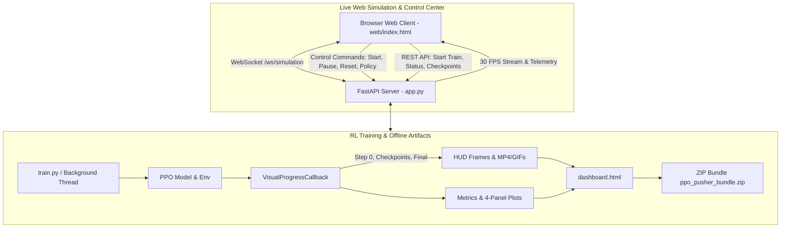

# 🏛️ 시스템 아키텍처 및 폴더 구조 (Pusher-v5 RL & Live Web Platform)

## 1. 프로젝트 목적 및 개요
Gymnasium MuJoCo 7자유도 로봇 팔 환경(`Pusher-v5`)에서 Stable-Baselines3 PPO 알고리즘을 학습시키고, **학습 전 과정을 실시간 HUD 오버레이, 체크포인트별 MP4/GIF 비디오, 고해상도 분석 차트, 인터랙티브 HTML 웹 대시보드 및 실시간 브라우저 시뮬레이터(FastAPI + WebSocket)**로 시각화하여 최종 모델 및 모든 산출물을 **단일 ZIP 압축 패키지**로 관리합니다.

---

## 2. 기술 스택 (Tech Stack)
*   **RL Framework:** Gymnasium 1.3.0 (`Pusher-v5` MuJoCo physics engine)
*   **Algorithm:** Stable-Baselines3 2.9.0 (PPO, `MlpPolicy`, PyTorch backend)
*   **Web Server & WebSocket:** FastAPI, Uvicorn, Starlette, WebSockets
*   **Frontend Client:** HTML5/CSS3/JavaScript (Dark Futuristic Glassmorphism), Chart.js (Real-time Telemetry Dynamics)
*   **Visualization & Media:** Pillow (PIL HUD Text Overlay), imageio (MP4/GIF), Matplotlib (Dark Theme 4-panel analysis)
*   **Packaging:** Python `zipfile` (Deflated compression)

---

## 3. 실행 파이프라인 (Execution Flow)

---

## 4. 폴더 및 파일 구조 규칙 (Directory Structure)

*   `app.py` : FastAPI 기반 실시간 웹 시뮬레이션 스트리밍, WebSocket 서버, REST API 및 실시간 PPO 학습 로거
*   `web/` : 실시간 관제 프론트엔드 웹 애플리케이션 (1-Screen Zero-Scroll Architecture)
    *   `web/index.html` : 영문 제어 버튼, 7-DOF 바이폴라 토크 게이지, 학습 프리셋 셀렉터, 4탭 덱(차트, 마일스톤 비디오, 실시간 터미널 로그, 스펙) UI
    *   `web/style.css` : OLED 하이콘트라스트 글래스모피즘 스타일시트, 바이폴라 바, 툴팁 시스템
    *   `web/app.js` : WebSocket 클라이언트, 3D 벡터 칩, 실시간 이동평균 차트, 마일스톤 비디오 플레이어, PPO 터미널 스트리밍
*   `train.py` : PPO 학습 메인 진입점, 시각화 콜백, 산출물 자동 패키징
*   `visualizer.py` : HUD 오버레이, 미디어 인코딩, 차트 생성, HTML 대시보드 생성 유틸리티
*   `evaluate.py` : 학습 완료된 `.zip` 모델의 독립 평가 및 비디오 추출기
*   `.cursorrules` : AI Vibe-Coding 방어 규칙
*   `DOCS_*.md` : AI 마스터 프로토콜 및 데이터 규격서
*   `results/` : 학습 산출물 기본 디렉토리
    *   `ppo_pusher.zip` : SB3 PPO 모델 바이너리
    *   `dashboard.html` : 웹 대시보드
    *   `metrics.json` : 메트릭 기록
    *   `config.json` : 실행 하이퍼파라미터
    *   `plots/training_metrics.png` : 분석 차트
    *   `videos/*.mp4, *.gif` : 학습 단계별 렌더링 파일
*   `ppo_pusher_bundle.zip` : 전체 결과물 통합 압축 아카이브
