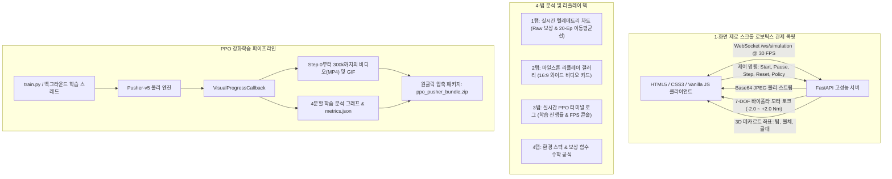

# 🦾 Pusher-v5 PPO // 인공지능 로보틱스 관제 허브 & 실시간 제어 콕핏

[](README.md)
[](README_KR.md)
[](https://huggingface.co/hwihwalab/pusher-v5-ppo)
[](https://github.com/Hwihwa-Lab/pusher-v5-ppo)
[](https://github.com/Hwihwa-Lab/pusher-v5-ppo/blob/main/LICENSE)
[](https://gymnasium.farama.org/environments/mujoco/pusher/)
[](https://pytorch.org)
[](https://stable-baselines3.readthedocs.io)

> **Gymnasium MuJoCo 7자유도 로봇 팔 연속 제어 텔레메트리 & PPO 심층 강화학습 통합 플랫폼**  
> *[ 🌐 English Documentation ](README.md) | [ 🇰🇷 한국어 매뉴얼 ](README_KR.md)*

본 리포지토리는 [Gymnasium](https://gymnasium.farama.org/environments/mujoco/pusher/)의 물리 시뮬레이션 환경인 `Pusher-v5`에서 7자유도(7-DOF) 로봇 팔이 원통형 물체를 목표 지점까지 정확하게 밀어 넣도록 학습시키는 **Stable-Baselines3 PPO 강화학습 시스템** 및 **실시간 30 FPS 웹 관제 콕핏(FastAPI + WebSocket)**을 제공합니다.

---

## 🌟 핵심 성능 및 모델 스펙

| 항목 | 상세 규격 및 벤치마크 결과 |
| :--- | :--- |
| **학습 환경** | Gymnasium MuJoCo `Pusher-v5` (7자유도 로봇 매니퓰레이터) |
| **관측 공간 (Observation)** | 23차원 연속 벡터 (관절 각도 7, 관절 각속도 7, 팁 위치 3, 물체 위치 3, 골 위치 3) |
| **행동 공간 (Action)** | 7차원 연속 모터 토크 제어값 (`Box[-2.0, 2.0]`, float32) |
| **학습 알고리즘** | Proximal Policy Optimization (PPO, `MlpPolicy`) |
| **백엔드 프레임워크** | Stable-Baselines3 / PyTorch / FastAPI / Starlette WebSockets |
| **초기 기초 점수 (Step 0)** | **`-57.51 pts`** (무작위 관절 탐색, 팔-물체 거리 0.215m) |
| **최종 수렴 점수 (Step 300k+)**| **`-32.42 ± 4.30 pts`** *(최고 에피소드: **`-26.15 pts`**)* |
| **팔-물체 접촉 정밀도** | **`0.028 m (2.8cm)`** (원통 물체 완벽 포착 및 밀착) |
| **목표 지점 근접 정밀도** | **`0.054 m`** (목표 골대 안착 및 푸싱 완료) |

---

## 🏛️ 시스템 아키텍처 및 데이터 흐름



---

## 🎮 관제 센터 주요 기능

1. **초저지연 30 FPS 실시간 물리 캔버스**:
   - 웹소켓을 통한 고속 렌더링 스트림 및 실시간 FPS 카운터.
   - 7개 관절 모터 토크를 중앙 0.0 기준으로 양수(청록색, Cyan)와 음수(장미색, Rose)로 실시간 시각화하는 **7-DOF 바이폴라 토크 게이지**.
   - 로봇 손가락 끝(Tip), 물체(Object), 골대(Goal)의 3D 공간 좌표 X, Y, Z 미터 단위 정밀 추적.
   - 키보드 단축키 지원 (<kbd>Space</kbd> 시작/일시정지, <kbd>R</kbd> 리셋, <kbd>S</kbd> 1스텝 전진, <kbd>H</kbd> HUD 온오프).

2. **강화학습 예산 프리셋 셀렉터**:
   - `500 Ep (50k Steps • ~12s) - 빠른 테스트`
   - `2,000 Ep (200k Steps • ~45s) - 기본 푸싱 학습`
   - `5,000 Ep (500k Steps • ~1.8m) ★ 추천 완성형 정책`
   - `10,000 Ep (1M Steps • ~3.5m) - 초정밀 수렴`
   - `⚙️ 사용자 정의(Custom) 스텝 설정`

3. **16:9 와이드 멀티 비디오 카드 갤러리**:
   - 스텝 0부터 최종 스텝까지 AI의 성장 과정을 넷플릭스 썸네일처럼 한눈에 가로로 비교하는 비디오 카드 릴.
   - 카드별 독립 **`MP4 비디오`** 및 **`GIF 애니메이션`** 즉시 다운로드 기능.

4. **단일 ZIP 파일 자동 패키징**:
   - 상단 `Download Bundle` 버튼을 누르면 학습된 모델 가중치(`ppo_pusher.zip`), 비디오, 차트, 메트릭이 하나의 압축 파일(`ppo_pusher_bundle.zip`)로 즉시 다운로드됩니다.

---

## 🚀 빠른 시작 가이드 (Quickstart)

### 1. 환경 설치
```bash
git clone https://github.com/Hwihwa-Lab/pusher-v5-ppo.git
cd pusher-v5-ppo
pip install -r requirements.txt
```

### 2. 실시간 웹 관제 센터 실행
```bash
python app.py
```
브라우저에서 **`http://localhost:8000`** 접속.

### 3. 허깅페이스 원클릭 자동 배포
```bash
python deploy_to_hf.py
```

### 4. CLI 기반 독립 학습 및 모델 평가
```bash
# PPO 에이전트 학습 실행
python train.py --timesteps 300000 --eval_freq 30000

# 학습 완료된 모델 독립 평가 및 비디오 추출
python evaluate.py --model_path ./results/ppo_pusher.zip --episodes 5
```

---

## 🐍 5줄 파이썬 빠른 평가 스니펫 (Quick Evaluation)

본 리포지토리의 학습 완료 가중치를 불러와 5줄의 파이썬 코드로 즉시 시뮬레이션을 실행할 수 있습니다:

```python
import gymnasium as gym
from stable_baselines3 import PPO

# 1. Pusher-v5 환경 초기화 및 완성 가중치 로드
env = gym.make("Pusher-v5", render_mode="human")
model = PPO.load("results/ppo_pusher.zip")

# 2. 결정론적 푸싱 제어 롤아웃 실행
obs, _ = env.reset()
done = False
while not done:
    action, _ = model.predict(obs, deterministic=True)
    obs, reward, terminated, truncated, _ = env.step(action)
    done = terminated or truncated

env.close()
```

---

## ⌨️ 키보드 단축키 안내 (Keyboard Shortcuts)

| 단축키 | 조작 기능 | 설명 |
| :---: | :--- | :--- |
| **`Space`** | **시작 / 일시정지** | 실시간 30 FPS MuJoCo 물리 시뮬레이션 토글 |
| **`R`** | **환경 초기화 (Reset)** | 로봇 팔, 원통 물체, 목표 골대를 새로운 랜덤 위치로 재배치 |
| **`S`** | **1스텝 전진 (Step Once)** | 물리 엔진을 1단위 타임스텝(0.05초) 전진 |
| **`H`** | **HUD 온오프 토글** | 캔버스 화면 위 텔레메트리 오버레이 표시/숨김 |

---

## 🛡️ AI 엔지니어링 거버넌스 및 문서 체계

본 시스템은 강화학습 시뮬레이션의 물리적 무결성을 보존하고 바이브-코딩 드리프트를 방지하기 위해 정밀한 엔지니어링 문서 프로토콜(GitHub 제공)을 준수합니다:

- **[`.cursorrules`](https://github.com/Hwihwa-Lab/pusher-v5-ppo/blob/main/.cursorrules)**: AI 코딩 방어 및 규칙 마스터 헌법
- **[`DOCS_AI_CODING_PROTOCOL.md`](https://github.com/Hwihwa-Lab/pusher-v5-ppo/blob/main/DOCS_AI_CODING_PROTOCOL.md)**: 코딩 표준 및 전체 문서 맵
- **[`DOCS_SYSTEM_ARCHITECTURE.md`](https://github.com/Hwihwa-Lab/pusher-v5-ppo/blob/main/DOCS_SYSTEM_ARCHITECTURE.md)**: 풀스택 시스템 및 WebSocket 아키텍처 명세서
- **[`DOCS_DATA_SCHEMA.md`](https://github.com/Hwihwa-Lab/pusher-v5-ppo/blob/main/DOCS_DATA_SCHEMA.md)**: 텔레메트리 패킷 프로토콜 및 REST 데이터 스키마
- **[`DOCS_MODEL_EVALUATION_AND_HF_DEPLOY.md`](https://github.com/Hwihwa-Lab/pusher-v5-ppo/blob/main/DOCS_MODEL_EVALUATION_AND_HF_DEPLOY.md)**: 벤치마크 평가 및 허깅페이스 배포 규격서

## 📂 리포지토리 파일 구성 (Repository Contents)

* `README.md`: 영문 글로벌 모델 카드 및 벤치마크 가이드.
* `README_KR.md`: 한국어 종합 기술 매뉴얼 ([한국어 매뉴얼](README_KR.md)).
* `app.py`: FastAPI 고성능 백엔드 및 30 FPS WebSocket 물리 스트리밍 서버.
* `train.py`: Stable-Baselines3 PPO 7자유도 로봇 팔 강화학습 엔진 (`VisualProgressCallback` 내장).
* `evaluate.py`: 독립 5회 연속 롤아웃 성능 평가기 및 비디오 녹화기.
* `visualizer.py`: 독립 Matplotlib 텔레메트리 시각화 및 그래프 생성 모듈.
* `web/`: 1-화면 제로 스크롤 웹 관제 콕핏 프론트엔드 (`app.js`, `index.html`, `style.css`).
* `results/ppo_pusher.zip`: 300,000 스텝 완성형 PPO 신경망 가중치 (평균 -32.4 pts).
* `ppo_pusher_bundle.zip`: 가중치, 12개 체크포인트 비디오, 분석 차트가 포함된 단일 프로덕션 배포 압축본.
* `deploy_to_hf.py`: 허깅페이스 모델 허브 원클릭 자동 배포 스크립트.
* `requirements.txt` & `packages.txt`: 파이썬 패키지 및 OS 의존성 명세서.

---

## 🔗 오픈소스 공식 링크 (Open Source Hubs)

- 🐙 **GitHub 저장소**: [https://github.com/Hwihwa-Lab/pusher-v5-ppo](https://github.com/Hwihwa-Lab/pusher-v5-ppo)
- 🤗 **Hugging Face 모델 허브**: [https://huggingface.co/hwihwalab/pusher-v5-ppo](https://huggingface.co/hwihwalab/pusher-v5-ppo)

---

## 📄 라이선스
본 프로젝트는 [MIT License](https://github.com/Hwihwa-Lab/pusher-v5-ppo/blob/main/LICENSE)를 따릅니다.

---

*Trained and deployed with [Pusher AI Hub](https://huggingface.co/hwihwalab/pusher-v5-ppo) by **hwihwalab**.*
